Homework-Q1-5
================
Jasper Wong
February 24, 2017

Introduction:
=============

I will be analyzing a publicly-available gene expression study of normal human bronchial epithelial (NHBE) cells, run on the Affymetrix GeneChip Human Genome U133 Plus 2.0 Array. Data was taken from the study: [Time course of NHBE cells exposed to whole cigarette smoke (full flavor)](https://www.ncbi.nlm.nih.gov/geo/query/acc.cgi?acc=GSE10718), and data was further filtered and taken from the [GSAT540 course website](https://github.com/STAT540-UBC/STAT540-UBC.github.io/blob/master/homework/assignment/homework.md).

Note: Please refer to the .Rmd file to examine the specific code involved. I have set most of the chunks to echo = FALSE, to prevent excessive cluttering of code in the markdown.

Question 1: Data Inspection
===========================

1.1 Download and inspect the data
---------------------------------

Packages needed for this assignment:

Description of the datasets:

Data: 22737 x 23 dataframe There are 22737 genes in the data set and 23 samples. The expression value of each of these genes is included in the dataset.

Metadata: 23 x 3 dataframe This dataset includes the sample name, with corresponding treatments, time points, and external data name.

Examining the breakdown for the treatment and time, I see that there are two treatments (control and cigarette) and 4 time points (1h, 2h, 4h, 24h). These samples are divvied up into groups of three for each treatment-time pair. However, there is one sample missing from the treatment + 1h group, which may affect the balance of the design. Overall, the design looks good.

1.2 Basic data manipulation
---------------------------

I used the functions substr to only take the numeric portion of the vector; as.character to turn it into a character vector; as.numeric to convert that vector into a numeric vector.

``` r
metadata$num_time <- substr(as.character(metadata$time), 1, nchar(as.character(metadata$time))-2)
metadata$num_time <- as.numeric(metadata$num_time)

class(metadata$num_time)
```

    ## [1] "numeric"

``` r
unique(metadata$num_time)
```

    ## [1] 24  1  4  2

1.3 Basic graphing
------------------

Create a plot showing the gene expression data for a random probe and the averages for all possible combinations of agent and time.

I'm going to choose probe 1294\_at to examine. I specifically plotted the averages for each time point (highlighted in red).

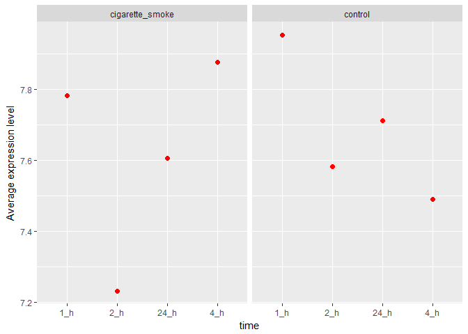

Question 2: Assessing data quality
==================================

2.1 Examine sample-to-sample correlations in a heatmap
------------------------------------------------------

Let's look at the data when sorted by time first.

``` r
suppressWarnings(library(pheatmap))

corrMatrix <- cor(data)
dim(corrMatrix)
```

    ## [1] 23 23

``` r
#ordering the samples by time and sorting by agent
metadata3 <- metadata[with(metadata, order(time, Treatment)),]
rownames(metadata3)
```

    ##  [1] "GSE10718_Biomat_16" "GSE10718_Biomat_17" "GSE10718_Biomat_10"
    ##  [4] "GSE10718_Biomat_11" "GSE10718_Biomat_12" "GSE10718_Biomat_19"
    ##  [7] "GSE10718_Biomat_20" "GSE10718_Biomat_21" "GSE10718_Biomat_7" 
    ## [10] "GSE10718_Biomat_8"  "GSE10718_Biomat_9"  "GSE10718_Biomat_4" 
    ## [13] "GSE10718_Biomat_5"  "GSE10718_Biomat_6"  "GSE10718_Biomat_1" 
    ## [16] "GSE10718_Biomat_2"  "GSE10718_Biomat_3"  "GSE10718_Biomat_22"
    ## [19] "GSE10718_Biomat_23" "GSE10718_Biomat_24" "GSE10718_Biomat_13"
    ## [22] "GSE10718_Biomat_14" "GSE10718_Biomat_15"

``` r
#this actually changes the rownames/row orders in the linear model later on so it will shoot out different answers

# ordering, alternate way
levels(metadata$time) <- c("1_h","2_h","4_h","24_h")

metadata3 <- metadata %>%
    rownames_to_column("sample") %>%
    arrange(time, Treatment) %>%
    column_to_rownames("sample")

annotation_row = data.frame(metadata3$time, metadata3$Treatment)
rownames(annotation_row) = rownames(metadata3)

corrMatrix <- corrMatrix[rownames(metadata3),rownames(metadata3)]
diag(corrMatrix) <- NA

pheatmap(corrMatrix, cluster_rows = FALSE, cluster_cols = FALSE, annotation_row = annotation_row)
```

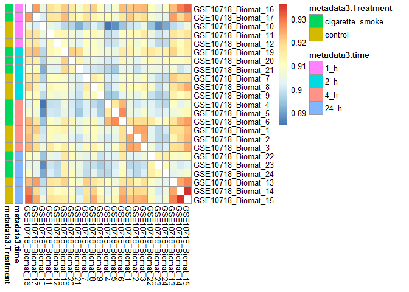

Note: Do not try to order the dataframe as above. I found an issue where if you order data using metadata\[with(metadata, order(time, Treatment)),\] (which does what you intend for pheatmap), but will continue to mess up every result you have from the limma and eBayes. After some careful examining, it appears that this error arises from the design matrix that is generated. The coordinates of the design matrix maps out based on the rownames of the metadata. Once you reorder the dataset, the rownames get altered as well. When you try to design a matrix, the design matrix will look at the variables associated with the new row1 of the reordered metadata, and will then assume that it matches the first column in the data matrix. This will mess everything up.

There doesn't seem to be any trend here in terms of time points. I took the diagonal to be N/A to increase the contrast in colours for other values. There also appears to be an outlier GSE10718\_Biomat\_10, though we'd need to look into that further.

There are small pockets of intense correlation, however, time does not feel like a strong factor.

Let's look at it in terms of treatment then.

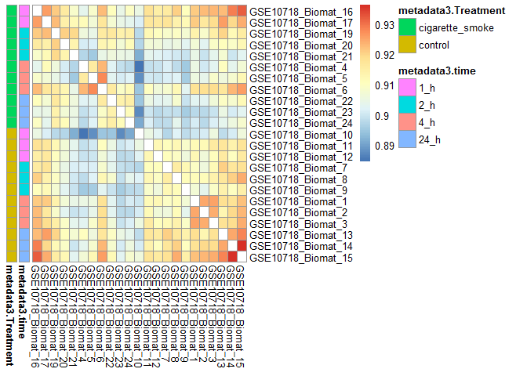

There appears to be a lower correlation between samples that were in the control and treatment group (specifically sections with more blue). However, this trend doesn't appear to be consistent. At the same time, the trend is a lot more apparent when sorting by treatment groups.

2.2 Assess the presence of outlier samples
------------------------------------------

Like mentioned above, GSE10718\_Biomat\_10 sticks out very distinctly relative to the rest. Let's look at this in terms of a boxplot of correlations.

    ## Warning: Removed 23 rows containing non-finite values (stat_boxplot).

    ## Warning: Removed 23 rows containing missing values (geom_point).

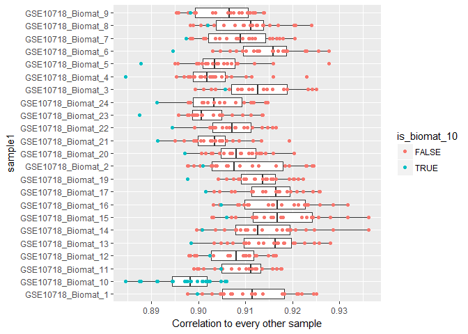

Sample Biomat\_10 stands out to the bottom end of every sample, and in many of these samples, it is considered as an outlier. This is an explicit pattern in the above boxplot.

To make this clearer, multidimensional scaling (from the package MASS) was used to highlight the distance of this sample from the rest of the samples.

    ## initial  value 11.711148 
    ## iter   5 value 8.917964
    ## iter  10 value 8.748991
    ## iter  15 value 8.342624
    ## iter  20 value 8.152583
    ## iter  20 value 8.151273
    ## iter  20 value 8.151041
    ## final  value 8.151041 
    ## converged

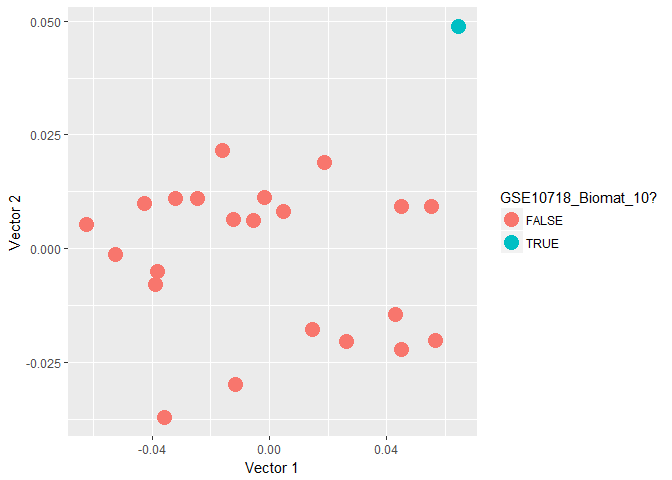

This shows that Biomat\_10 is a sample that is very far away from the rest of the cluster, another indication that it is an outlier.

Question 3: Differential expression with respect to treatment
=============================================================

3.1 Linear model
----------------

``` r
metadata$Treatment <- relevel(metadata$Treatment, ref = "control")
sampleDesMat <- model.matrix(~ Treatment, metadata)

sampleFit <- lmFit(data, sampleDesMat)
sampleEbFit <- eBayes(sampleFit)
```

The model used here is under the linear models for genetics package (limma). The linear model used falls under the standard linear model equation:

Y = Xa + epsilon,

where Y is a column vector of expected gene expression, X is a design matrix that represents the treatments Control and Cigarette, a is a column vector that indicates the parameters of the linear model (derived from the equation itself), epsilon represents a column vector for errors that deviate from your expected results.

In the context of this model, a linear regression (one-way ANOVA) is done to compare the variances between treatment groups.

3.2 Looking at hits
-------------------

Looking specifically at the output of the limma package. Let's take a look at the distribution of p-values in the form of a histogram.

    ## `stat_bin()` using `bins = 30`. Pick better value with `binwidth`.

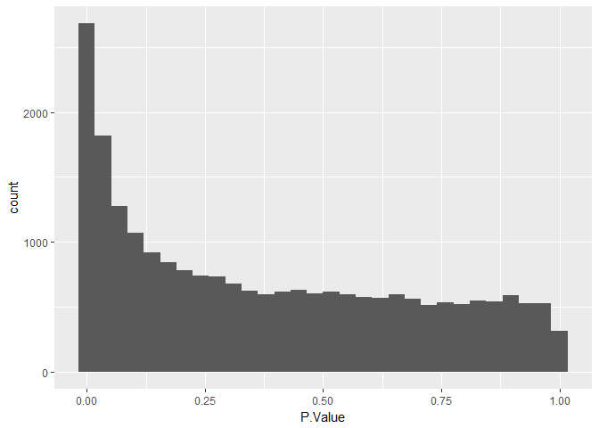

There appears to be an increased inflection of p-values as P.Value approaches 0. This is indicative of a significant and real effect observed.

Let's look at the FDR:

    ## Removing intercept from test coefficients

    ## [1] 805   6

It appears there are 805 genes with an unadjusted p-value of 1e-3 or less. Alternately, there are only 1238 genes with an adjusted p-value of less than 0.05.

Let's take the top 50 probes based on the model and put it in a heatmap sorted row-wise by adjusted p-values and sorted column-wise by Treatment and time.

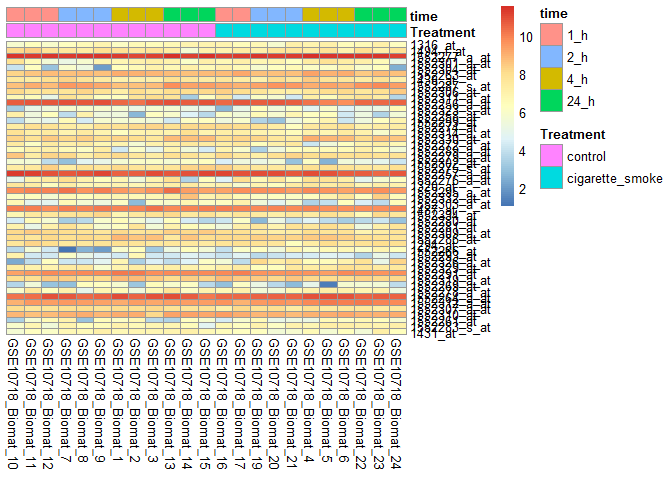

``` r
#Checking the FDR of the 50th probe.
(FDR <- top50probes[50, 'adj.P.Val'])
```

    ## [1] 0.001035992

``` r
#Estimating the expected number of false discoveries based on this.
FDR * 50
```

    ## [1] 0.05179962

If 50 is our number of significant genes (S), and our FDR (assumed to be the highest one in our list) to be 0.001035992, then it is expected that 0.05179962 genes in this top 50 would be false discoveries. Essentially, we would not expect any of these genes to be a false discovery.

Question 4: Differential expression with respect to time
========================================================

Treating time as a quantitative covariate (hours) instead of treatment.

4.1 Linear model
----------------

Using time as a numeric covariate, we can see that there are 958 genes that has an unadjusted p-value of 1e-3 or less and 1451 genes with a FDR of 0.05 or less.

Question 5: Differential expression analysis with a full model
==============================================================

5.1 Quantify the number of hits for treatment
---------------------------------------------

Finally, let's look at the effects of both factors.

``` r
bothDesMat <- model.matrix(~ Treatment * num_time, metadata)

bothFit <- lmFit(data, bothDesMat)
bothEbFit <- eBayes(bothFit)

topTablebothEbFit <- topTable(bothEbFit, coef = 2, number = Inf)

sum(topTablebothEbFit$P.Value < 0.001)
```

    ## [1] 621

``` r
significantbothEbFit <- topTablebothEbFit %>% 
    mutate(probes = rownames(topTablebothEbFit)) %>% 
    filter(P.Value <= 1e-3)

FDRbothEbFit <- topTablebothEbFit %>% 
    filter(adj.P.Val <= 0.05)
```

621 probes are treated as significant based on an unadjusted p-value cutoff of 1e-3 and 768 probes are treated as significant at the FDR 0.05 level.

This number is different from the values pulled down in 3.2. This is because time is also considered as an impacting factor to the derivation of expression patterns. As a result, the fundamental equation gets modified from Y = B0 + B1x1 + epsilon to Y = B0 + B1x1 + B2x2 + B12x1x2 + epsilon. There is also an interaction effect to consider between the two parameters now.

Let's look at the overlapping probes among the hits based on a p-value cutoff of 1e-3.

    ## [1] 328

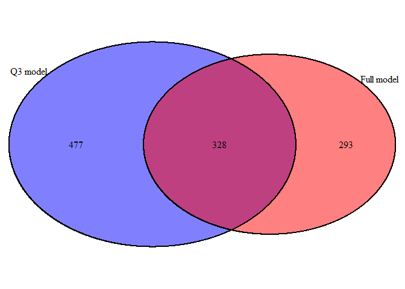

    ## (polygon[GRID.polygon.532], polygon[GRID.polygon.533], polygon[GRID.polygon.534], polygon[GRID.polygon.535], text[GRID.text.536], text[GRID.text.537], text[GRID.text.538], text[GRID.text.539], text[GRID.text.540])

    ## `stat_bin()` using `bins = 30`. Pick better value with `binwidth`.

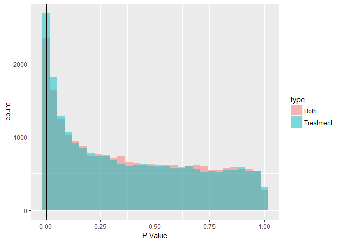

328 probes are found that overlap between the first model and the full model when using p-value cutoff of 1e-3.

A combined histogram shows that both has a higher number of P-values that are at and below a p-value cutoff of 1e-3 (vertical black line). The distributions are similar. However, there is a higher density of low p-values for the Treatment-only model. This may seem surprising, however, based on the linear model, more explanatory weight is shifted onto the treatment (i.e. y = a1x1). As a result of this, the model tries to explain all differences based on treatment differences.

However, with additional factors in the model (y = a1x1 + a2x2 + a12x1x2), then there is a shift in weight. Not everything in the model needs to be explained by a change in treatment any more, so there would be a lower amount of hits in the treatment component of the full model than there is in the treatment only model.

5.2 Test the null hypothesis
----------------------------

Null hypothesis: there is no significant interaction between time and treatment.

This interaction term represents the effect of one covariate on another in determining the Y response variable. In this case, it would represent how the time point of cigarette exposure could affect the rate at which gene expression is occurring.

    ## [1] 573

There are 573 probes that are significant at the unadjusted p-value of 1e-3 and 664 probes that are significant at the FDR of 0.05.

5.3 Plotting probes where interactions does and does not matter
---------------------------------------------------------------

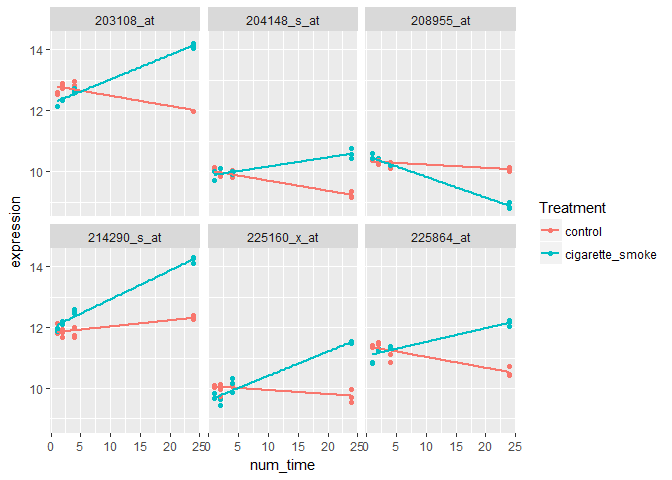

These interaction plots highlight the top 6 probes with the lowest FDR in the interaction effects. This can be observed by the distinct intersections and slopes that characterize the treatment group and the control group over time.

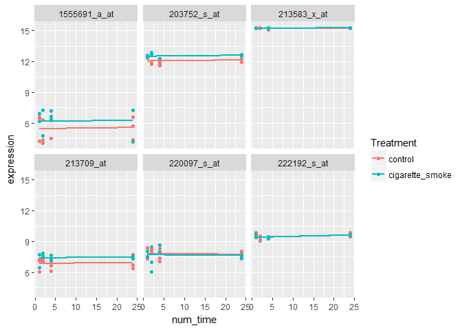

These interaction plots highlight the bottom 6 probes with the highest FDR in the interaction effects, which indicates that these are the least likely probes to be affected by the interaction effects of treatment and time. This can be observed by the distinctly parallel lines between treatment and control for each of these probes.
