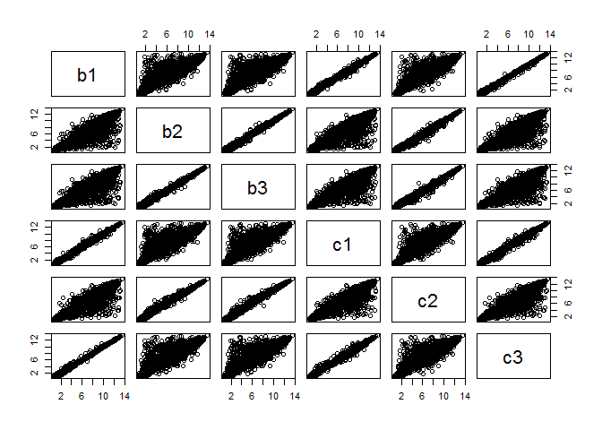
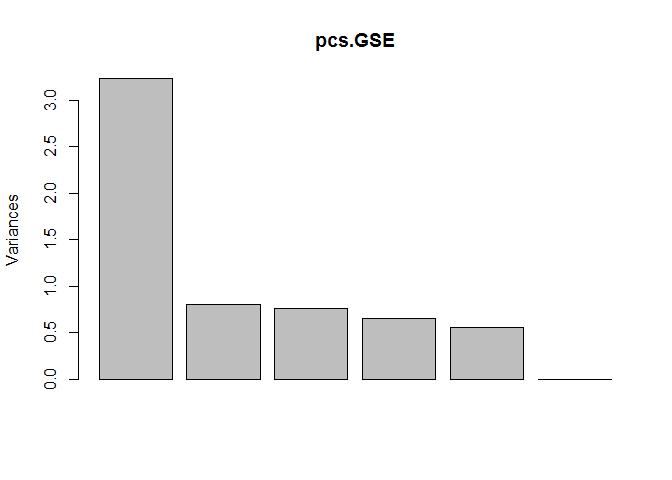

Homework-Q6-10
================
Jasper Wong
March 17, 2017

Question 6: Microarray analysis
===============================

6.1 Data loading and QC
-----------------------

Normalized data dimensions: 10928 x 7

There are 7 columns of data: The first column denotes the gene ID; the next three (b1, b2, b3) represents expression data of the three replicates of yeast grown in batch medium; the last three (c1, c2, c3) represents the expression data of the three replicates of yeast grown in chemostat.

Two of the samples have been swapped - need to identify which ones.

Let's look at a bunch of plots to identify the swapped samples: 

If similar samples have a more clustered straight line (i.e. correlation), then c2 is more related to b2 and b3, and b1 is more related to c1 and c3.

    ## Warning: Setting row names on a tibble is deprecated.


With the clustering based on the dendrogram (column-based), c1, c3, and b1 are clustered and c2, b2, and b3 are clustered. More evidence pointing at b1 and c2 as the swap.

    ## Warning: Setting row names on a tibble is deprecated.


With a heatmap of the Pearson correlations of each sample expression data, there is more evidence that c2 and b1 are the outliers from each group.

Let's look at PCA analyses:

    ## Warning: Setting row names on a tibble is deprecated.



The PCA indicates that there are two distinct clusters (b group and c group).

Altogether, all four plots agree that c2 and b1 are swapped.

6.2 Microarray DEA
------------------

Fixing the swapped labels.

    ## Removing intercept from test coefficients

    ## $`1772391_at`
    ## [1] "YIL057C"

6.3 Microarray DEA continue
---------------------------

Removing rows with probes that don't have genes:

Started with 10928 and ended with 5705 genes.

This volcano plot illustrates the top hits. Red points indicates fold changes that have a q greater than 1e-05 and blue points indicates significant fold changes that have a q less than 1e-05.


    ## [1] 725

725 probes are identified as differentially expressed at a FDR of 1e-5.

Question 7: RNA-seq analysis
============================

7.1 Load RNA Count Data and Sanity Check
----------------------------------------

    ## [1] 6542    6

Dimensions: 6542 x 6 Rows represent the RNA-seq expression levels. The columns represent the specific condition and replicate the sample is from. The main difference between this dataset and the ones in Question 6 is that this one uses HUGO-gene ID's instead of the numeric probe-ID's used by the microarray.


7.2 DEA of deep sequencing data
-------------------------------

    ## Disp = 0.00551 , BCV = 0.0742


    ## [1] "(Intercept)"        "Treatmentchemostat"

    ## [1] 2576

2576 genes are differentially expressed between the two conditions at a FDR of 1e-5.

Packaging these results in a data.frame and writing it into a table:

7.3 DEA of low sequencing data
------------------------------

Stampy low depth count data: repeat 7.2 with the new low count.

    ## [1] 7126    6

    ## Disp = 0.0042 , BCV = 0.0648


    ## [1] "(Intercept)"        "Treatmentchemostat"

    ## [1] 477

7.4 Deep vs low sequencing
--------------------------

Let's look at the overlaps between the two datasets that are differentially expressed based on FDR &lt; 1e-5.

    ## Loading required package: grid

    ## Loading required package: futile.logger


    ## (polygon[GRID.polygon.182], polygon[GRID.polygon.183], polygon[GRID.polygon.184], polygon[GRID.polygon.185], text[GRID.text.186], text[GRID.text.187], text[GRID.text.188], text[GRID.text.189])

### How many genes were identified by edgeR in both low and deep count data?

2576 genes were identified.

### How many genes were identified in all the analyses?

2576 genes were identified in edger deep results, and 477 genes were identified in edge low depth results. There are 2099 genes that are unique to edger\_low. There are 0 genes unique to edger\_deep.

It can be seen that with a library with a high depth, there are a lot more significant genes with a low FDR that can be pulled out relative to a library with a low depth. Furthermore, a library with a high depth can cover 100% of the genes that were covered in the low depth library, reflective of high specificity.

There are no unique genes in the low coverage set, because the FDR is set to such a low value (1e-5), that you should expect to see 0 false discoveries.

Question 8: Compare DEA results from RNA-Seq and Arrays
=======================================================

Comparing DEA results from RNA-seq (Q7) and microarray (Q6).

8.1 Plots of interesting and boring genes
-----------------------------------------

I need to first identify genes that are DE by both analyses and genes that are DE only in the microarray analysis and RNA-seq.

Let's create a function to pull down the data for a given gene. \#\#\#\#Function: pullGenes The only input is a gene name. It will then create a tmp object from RNAseq data and take out all the expression data from the two batches. It will also log10 the counts from the RNAseq data. It will then use this same gene name and match the appropriate probe from the microarray dataset. Once matched, it will then store the microarray data in a tmp2 object. Subsequently, a tmp3 object will merge the two tmp objects together and sort them in a manner that can be read by ggplot. Ggplot will then generate a faceted graph of both experiments with the experimental condition (batch and chemostat), as well as the expression (array and log10 counts for RNAseq).

``` r
pullGenes <- function(gene){
    
    tmp <- subset(RNAseq_data, row.names(RNAseq_data) == gene) %>% 
        t() %>% 
        as.data.frame() %>% 
        setNames("RNAseq") %>% 
        rownames_to_column("replicate") %>% 
        mutate(group = gsub("[0-9]", "", replicate)) %>% 
        mutate(RNAseq = log10(RNAseq + 0.00001))
    
    probename = subset(gene.ids, gene.ids == gene) %>% 
        names()
    tmp2 <- subset(GSE37599_data, row.names(GSE37599_data) == probename) %>% 
        t() %>% 
        as.data.frame() %>% 
        setNames("Microarray") %>% 
        rownames_to_column("replicate") %>% 
        mutate(group = gsub("[0-9]", "", replicate))
    
    tmp3 <- cbind(dplyr::select(tmp, RNAseq), arrange(tmp2, replicate)) %>%
        gather(key = expt, value = expression, -group, -replicate)
    
    ggplot(tmp3, aes(x = group, y = expression)) + geom_point() + 
        facet_wrap(~expt, scales = "free") + ggtitle(gene)
}
```

Two interesting genes identified by DE by both analyses: YIL057C and YMR175W.

One DE gene identified as DE only in the array analysis: YIL169C

One DE gene identified as DE only in the RNAseq analysis: YGR292W

One boring gene in both analyses: YPR156C

### DE in both

``` r
pullGenes("YIL057C") #interesting ones defined by both
```


Both shows a distinctive pattern.

``` r
pullGenes("YMR175W")
```


RNAseq shows a much more distinctive pattern here too for the other interesting gene.

### DE in microarray only

``` r
pullGenes("YIL169C")
```


This gene was identified as DE only in the array analysis. It does not seem all that convincing however.

### DE in RNAseq only

``` r
##pullGenes("YGR292W") This one would throw an error - there is no matching Microarray data; I rather not include a tryCatch() in my function, so I will manually create this:
tmp <- subset(RNAseq_data, row.names(RNAseq_data) == "YGR292W") %>% 
        t() %>% 
        as.data.frame() %>% 
        setNames("logCounts") %>% 
        rownames_to_column("replicate") %>% 
        mutate(group = gsub("[0-9]", "", replicate)) %>% 
        mutate(expression = log10(logCounts + 0.00001))
ggplot(tmp, aes(x = group, y = expression)) + geom_point() +
        ggtitle("YGR292W")
```


This gene was identified as DE only in the RNAseq analysis. This gene was also not pulled down by the microarray at all.

### boring gene in both (i.e. high adj.P.Val for both)

``` r
pullGenes("YPR156C")
```


This gene was a boring gene in both analysis. As seen here, it appears that there is no distinctive pattern observed in either assay.

Question 9: Trying another package
==================================

9.1 DEA with voom + limma on deep seq data
------------------------------------------

Voom: mean-variance trend 

    ## Removing intercept from test coefficients

How many genes are differentially expressed at a FDR of 1e-5?

``` r
nrow(voom.limma.deep.results[voom.limma.deep.results$q.value <= 1e-5,])
```

    ## [1] 1794

9.2 DEA with voom+limma on low seq data
---------------------------------------

Voom: mean-variance trend with low seq data: 

    ## Removing intercept from test coefficients

How many genes are differentially expressed at a FDR of 1e-5?

``` r
nrow(voom.limma.low.results[voom.limma.low.results$q.value <= 1e-5,])
```

    ## [1] 0

9.3 Compare your results with edgeR:
------------------------------------

Voom+limma vs edgeR

Let's first look at limma on deep and limma on low. 

    ## (polygon[GRID.polygon.660], polygon[GRID.polygon.661], polygon[GRID.polygon.662], polygon[GRID.polygon.663], text[GRID.text.664], text[GRID.text.665], text[GRID.text.666], text[GRID.text.667])

There are 0 results for low coverage; and 1794 results for deep coverage.

Let's compare it to the EdgeR one again:


    ## (polygon[GRID.polygon.668], polygon[GRID.polygon.669], polygon[GRID.polygon.670], polygon[GRID.polygon.671], text[GRID.text.672], text[GRID.text.673], text[GRID.text.674], text[GRID.text.675])

There appears to be a lot more discoveries in the EdgeR version. Perhaps this is indicative of the sensitivity of the package. Let's look at a comparison between limma high and edgeR high:


    ## (polygon[GRID.polygon.676], polygon[GRID.polygon.677], polygon[GRID.polygon.678], polygon[GRID.polygon.679], text[GRID.text.680], text[GRID.text.681], lines[GRID.lines.682], text[GRID.text.683], text[GRID.text.684])

So there are more returns from edgeR deep than there are from limma deep (782 more). Furthermore, there are no unique genes in limma that edger didn't pick up.

It appears that edgeR overall is a much stronger method than limma.
