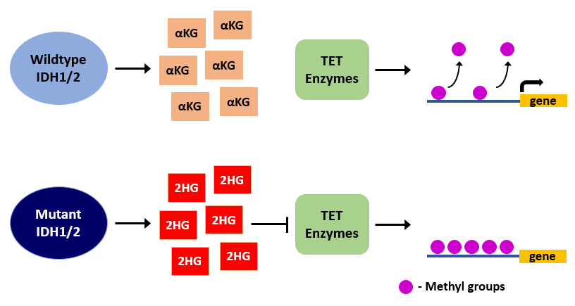
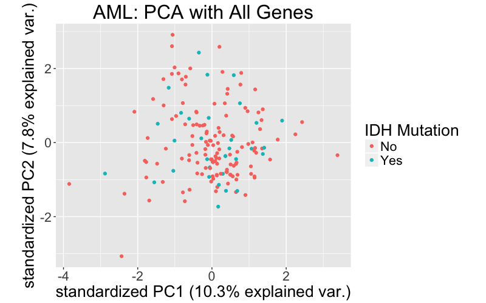
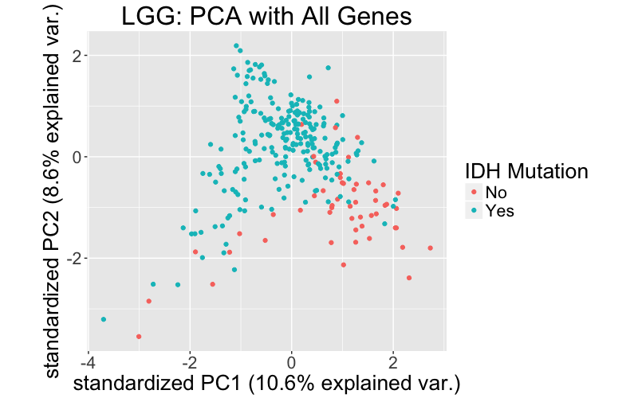
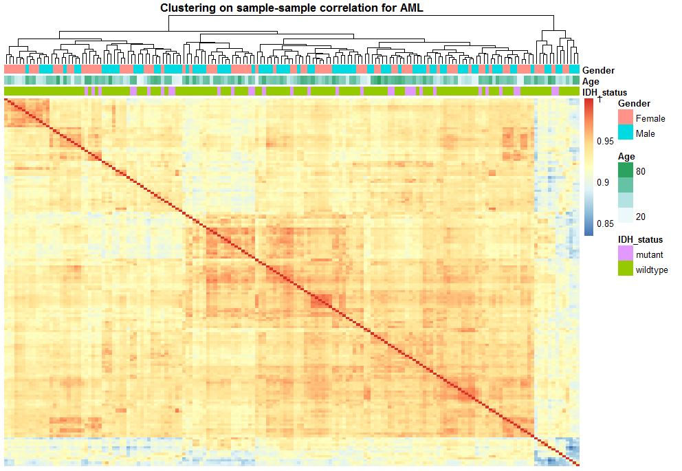
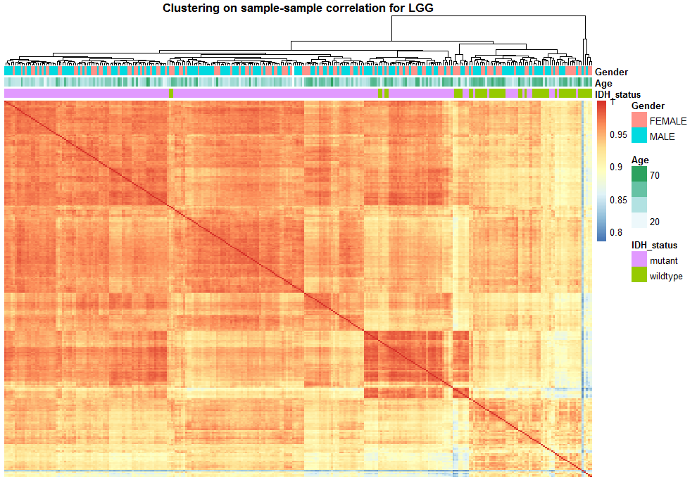
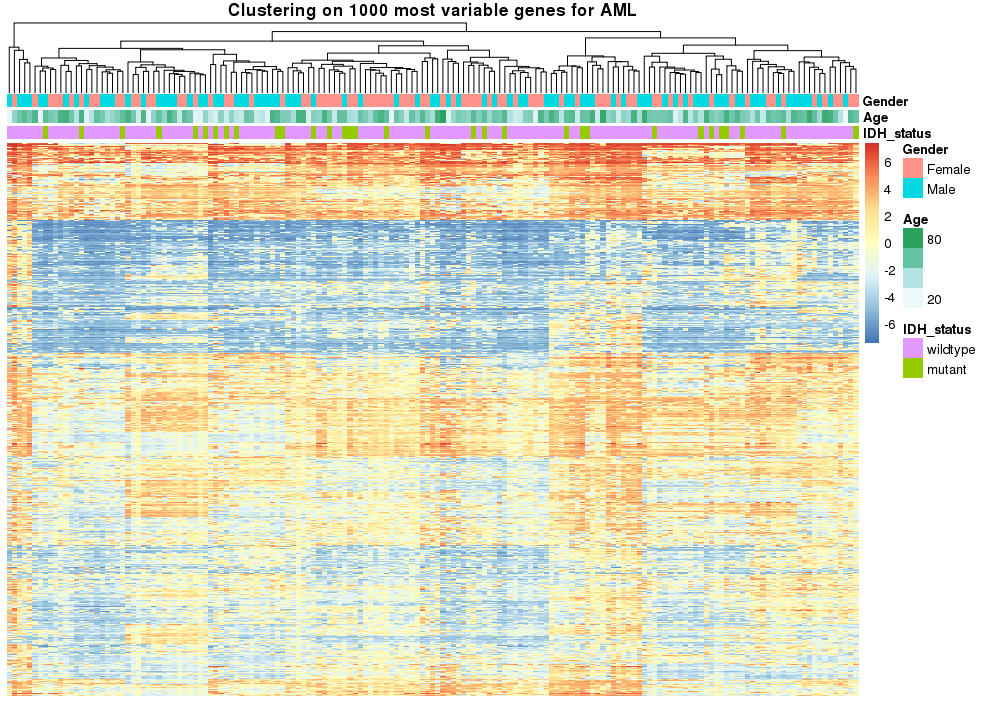
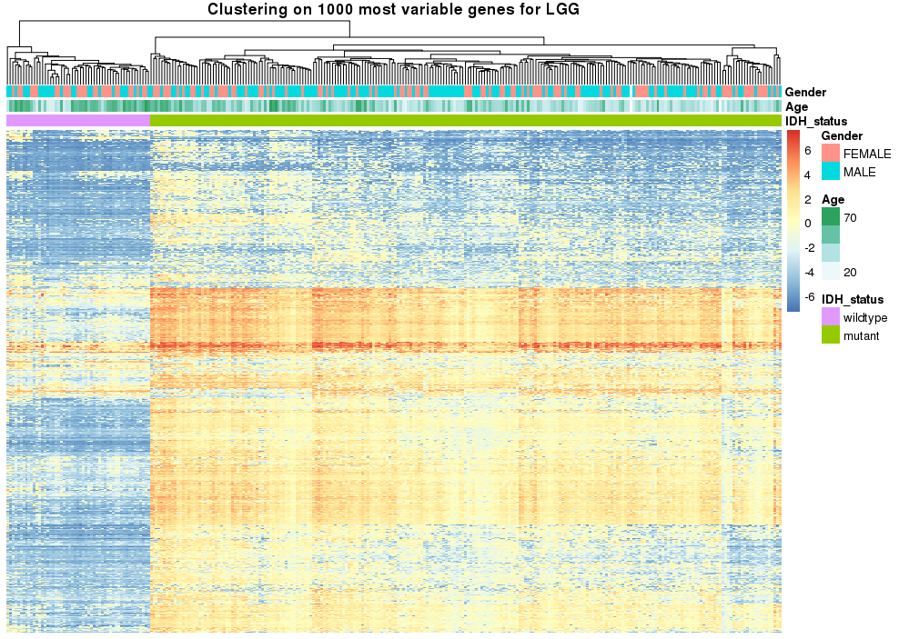
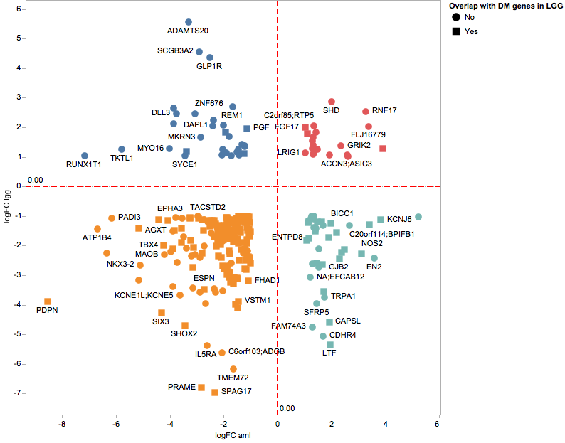
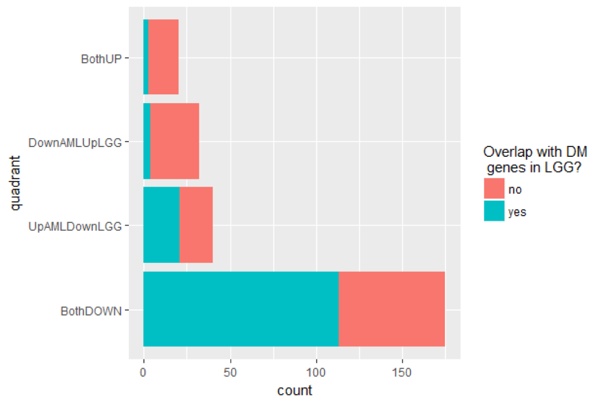
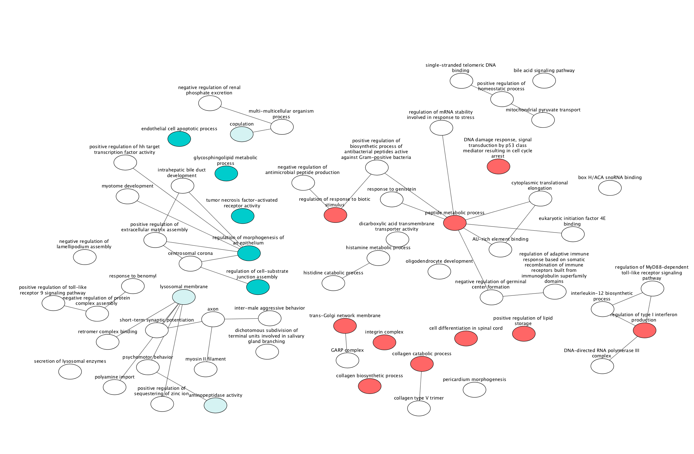

# Exploring the Cellular Consequences of IDH Mutations in Acute Myeloid Leukemia and Lower Grade Glioma

**Team: 5mC on an Island**

Note:

Group project as per requirements of the course GSAT540. My research was based around IDH1 mutations in AML and Stephen Lee's was based around IDH1 mutations in LGG. I came up with the idea to compare methylation and expression patterns of IDH1 mutant genomes in AML and LGG, and I performed most of the RNA-seq analyses presented here.

## Group Members
| Name          | Background                    | Affiliation                   |
| ------------- | ----------------------------- | ----------------------------- |
| Grant de Jong | Genetics                      | Genome Science and Technology |
| Jasper Wong   | Genetics, Cell biology        | Genome Science and Technology |
| Jie Cui       | Statistics                    | Department of Statistics      |
| Mary He       | Statistics                    | Department of Statistics      |
| Stephen Lee   | Genetics, Nutritional Science | Genome Science and Technology |

## 1. Background

Neomorphic IDH mutations are prevalently observed in Acute Myeloid Leukemia (AML) [[1](https://www.ncbi.nlm.nih.gov/pubmed/22917530)] and Lower Grade Glioma (LGG) [[2](https://www.ncbi.nlm.nih.gov/pubmed/23532369)] and impart an aberrant function for the encoded enzyme, resulting in production of the oncometabolite 2-hydroxyglutarate (2-HG) [[3](https://www.ncbi.nlm.nih.gov/pubmed/19935646)]. 2-HG inhibits the Tet-mediated DNA demethylation process, resulting in global hypermethylation of DNA regulatory elements[[4](https://www.ncbi.nlm.nih.gov/pubmed/22343889), [5](https://www.ncbi.nlm.nih.gov/pubmed/21130701?dopt=Abstract&holding=npg)]. To our knowledge, no study to date has compared the consequences of IDH mutations between AML and LGG. To better understand the role of IDH in cancer, we are interested in investigating the consequences of IDH mutations on global gene expression and methylation in AML and LGG.

**Mutant IDH inhibits the TET-mediated DNA demethylation process resulting in a hypermethylated phenotype. *αKG, alpha-ketoglutarate, 2HG, 2-hydroxyglutarate.***

## 2. Questions

1. **What are the consequences of IDH mutations on global gene expression and DNA methylation in Acute Myeloid Leukemia (AML) and Low Grade Glioma (LGG)?**
2. **Are the consequences of IDH mutations similar between AML and LGG? Do they converge on similar pathways or are they contextually specific?**

## 3. Contents of Our Repository

### 3.1. Data

- Raw Data: Our AML and LGG cancer datasets originate from studies conducted by The Cancer Genome Atlas (TCGA) [[1](https://www.ncbi.nlm.nih.gov/pubmed/22917530), [2](https://www.ncbi.nlm.nih.gov/pubmed/23532369)] and was collected from cBioPortal [6](https://www.ncbi.nlm.nih.gov/pubmed/22588877). Our datasets include clinical data, somatic mutation data, RNA expression data and DNA methylation data.

## 4. Statistical Analyses and Results

### 4.1. Study Groups

From the TCGA datasets we defined IDH mutant patients as those who had at least one mutation in the *IDH1* or *IDH2* gene in the somatic mutation data. Patients must have had their tumors sequenced and profiled for RNA expression and DNA methylation to be included in our analysis. After excluding those who failed to meet this criteria, we identified 165 AML patients (133 IDH wildype, 32 IDH mutant) and 286 LGG patients (53 IDH wildtype, 233 IDH mutant).

| Cancer Type    | IDH Wildtype    | IDH Mutant    | Total    |
| -------------- | --------------- | ------------- | -------- |
| AML            | 133             | 32            | 165      |
| LGG            | 53              | 233           | 286      |

### 4.2 RNA Expression Analysis

- [Exploratory_PCAplot.R](https://github.com/Jwong684/bioinformatics/tree/master/analyses/sampleCoursework/Exploratory_PCAplot.R)

- [Initial Differential Expression Analysis in limma](https://github.com/Jwong684/bioinformatics/tree/master/analyses/sampleCoursework/Differential_expression.md): Initially we performed our differential expression analysis with limma.

- [Further Differential Expression Analysis in edgeR](https://github.com/Jwong684/bioinformatics/tree/master/analyses/sampleCoursework/EdgeR_differential_expression.md): We decided to go with EdgeR due to its higher detection rate in identifying differentially expressed genes.

To assess the effects of IDH mutations on the transcriptome we performed principal component and clustering analyses on RNA expression.

Samples were plotted on the first-two PCs. IDH-mutantand IDH-WT samples form two clear clusters for LGG, but showed no distinguishable grouping pattern for AML.

Hierarchical clustering with Euclidean distance was used to make the heatmaps of the Spearman correlation matrices based on the entire RNA expression data. There is clear segregation of IDH wildtype and IDH mutant patients for LGG but not for AML, consistent with the PCA.

At a FDR of 0.1, 10980 genes were found to be differentially expressed in LGG and 1568 in AML. We used a more lenient FDR here to capture more genes in AML. 1006 genes were commonly DE in both AML and LGG. The much lower number of DE genes in AML and the PC and clustering analyses suggest that IDH mutations have much less dyregulatory effects in AML than in LGG.

### 4.3.DNA Methylation Analysis

Next, we wanted to assess the global DNA methylation landscape with respect to IDH mutations. 

Clustering was performed as it was for RNA expression data, except here we show clustering based on the top 1000 most variable genes from the DNA methylation data. Consistent with the finding with RNA expression, and even more striking here, LGG patients completely cluster based on their IDH status while AML patients do not. 

An absolute difference threshold of M > 1 (falls in the middle of threshold range suggested by Pan et al [7]) and a FDR cutoff of 0.05 was applied to identify significantly DM genes (AML: 0 genes, LGG: 9479 genes). The absence of differentially methylated genes in AML supports what we see based on our clustering analysis. Similar to our finding from RNA expression, IDH mutations does not seem to affect DNA methylation in AML.

### 4.4 DE Gene Overlap and Function Analysis

Since we found 1006 commonly DE genes between AML and LGG, we wanted to see whether there was a convergence on dysregulated pathways. From this group of genes further filtering was conducted to select for genes that had at least a 2-fold difference between IDH wildtype and mutant (|log2FC| > 1).

This geneset is partitioned based on its expression pattern in AML and LGG: downregulated in both (orange), upregulated in both (green), up in LGG but down in AML (blue), and down in LGG but up in AML (red). Genes that overlapped with LGG-DM genes (squares) are also represented. Genes that have previously been described to be dyregulated in IDH mutant gliomas were also identified here such as PDPN [8], providing credibility to our analysis.

More than half of the genes that were similarly dyregulated between AML and LGG were also differentially methylated in LGG.

DE genes called by EdgeR were assigned relevant gene ontology (GO) terms through GOSeq [9](https://genomebiology.biomedcentral.com/articles/10.1186/gb-2010-11-2-r14). The resulting overrepresented p-values were calculated via Wallenius Approximation due to computational efficiency. 

The top ten GOSeq-approximated overrepresented p-values were plotted for the DE gene sets illustrated in the quadrant plot (plot order corresponds to each quadrant). The enrichment
analysis suggests very little functional overlap between LGG and AML.

The network illustrates GO enrichment fordownregulated genes shared among LGG
and AML. Significantly enriched GO terms are highlighted in blue (LGG) and red
(AML). There are no mutually enriched ontologies, in addition to no node connectivity between enriched LGG and AML functional clusters.

## 5. Conclusions 

Our analyses are exploratory in nature; they do not allow for conclusive interpretations on the role of IDH mutations in AML and LGG.

- Differential DNA methylation and gene expression appear to be associated with IDH mutations in LGG but not in AML.

- In agreement with this disparity, we found virtually no overlap on the functional pathways from commonly DE genes between AML and LGG, despite having 267 commonly DE genes.

- Overall, there appears to be a disparity in the cellular consequences of IDH mutations, in terms of RNA expression and DNA methylation, between AML and LGG.

- Our results provide an interesting hypothesis for mutant IDH to play a contextually specific role in AML that may be unrelated to its well-characterized dysregulatory effects on DNA methylation and gene expression.

## 6. Changes from initial proposal

Initially, we were interested in whether CTCF binding sites were also disrupted as a result of IDH mutations in AML as it has been demonstrated in LGG [10](https://www.ncbi.nlm.nih.gov/pubmed/26700815). However, due to the interest of time and lack of good quality datasets on CTCF binding sites, we decided not to pursue this research direction. Another question we had was whether mutations in genes that encode for TET enzymes would also recapitulate the effects of IDH mutations. However, too few patients were found to possess TET mutations in our datasets and would not have provided statistical meaningful results.

## 7. Further Directions

- In retrospect, partitioning our sample population and applying a cross-validation approach for our clustering analyses would have provided a method for assessing whether the results we observed are generalizable across independent datasets. Thus, our analysis should be repeated for additional AML and LGG patients.

- We also acknowledge that we did not consider other mutated genes known to dysregulate DNA methylation and gene expression such as DNA methyltransferases (DNMTs) and TET. Future work should take mutations in these genes into account since they may recapitulate the effects of IDH mutations. We did not address these genes in our analysis because they are less characterized in the literature compared to IDH and so we lacked confidence in assigning patients into specific groups by their mutational status.

## References

1. [Rakheja, Dinesh, et al. "IDH mutations in acute myeloid leukemia." Human pathology 43.10 (2012): 1541-1551.](https://www.ncbi.nlm.nih.gov/pubmed/22917530)
2. [Yan, Hai, et al. "IDH1 and IDH2 mutations in gliomas." New England Journal of Medicine 360.8 (2009): 765-773.](https://www.ncbi.nlm.nih.gov/pubmed/23532369)
3. [Dang, Lenny, et al. "Cancer-associated IDH1 mutations produce 2-hydroxyglutarate." Nature 462.7274 (2009): 739-744.](https://www.ncbi.nlm.nih.gov/pubmed/19935646)
4. [Turcan, Sevin, et al. "IDH1 mutation is sufficient to establish the glioma hypermethylator phenotype." Nature 483.7390 (2012): 479-483.](https://www.ncbi.nlm.nih.gov/pubmed/22343889)
5. [Figueroa, Maria E., et al. "Leukemic IDH1 and IDH2 mutations result in a hypermethylation phenotype, disrupt TET2 function, and impair hematopoietic differentiation." Cancer cell 18.6 (2010): 553-567.](https://www.ncbi.nlm.nih.gov/pubmed/21130701?dopt=Abstract&holding=npg)
6. [Cerami, Ethan, et al. "The cBio cancer genomics portal: an open platform for exploring multidimensional cancer genomics data." (2012): 401-404.](https://www.ncbi.nlm.nih.gov/pubmed/22588877)
7. [Du, Pan, et al. "Comparison of Beta-value and M-value methods for quantifying methylation levels by microarray analysis." BMC bioinformatics 11.1 (2010): 587.](https://bmcbioinformatics.biomedcentral.com/articles/10.1186/1471-2105-11-587)
8. [Peterziel, Heike, et al. "Expression of podoplanin in human astrocytic brain tumors is controlled by the PI3K-AKT-AP-1 signaling pathway and promoter methylation." Neuro-oncology 14.4 (2012): 426-439.](https://academic.oup.com/neuro-oncology/article/14/4/426/1054427/Expression-of-podoplanin-in-human-astrocytic-brain)
9. [Young, Matthew D., et al. "Gene ontology analysis for RNA-seq: accounting for selection bias." Genome biology 11.2 (2010): R14.](https://genomebiology.biomedcentral.com/articles/10.1186/gb-2010-11-2-r14)
10. [Flavahan, William A., et al. "Insulator dysfunction and oncogene activation in IDH mutant gliomas." Nature 529.7584 (2016): 110-114.](https://www.ncbi.nlm.nih.gov/pubmed/26700815)
